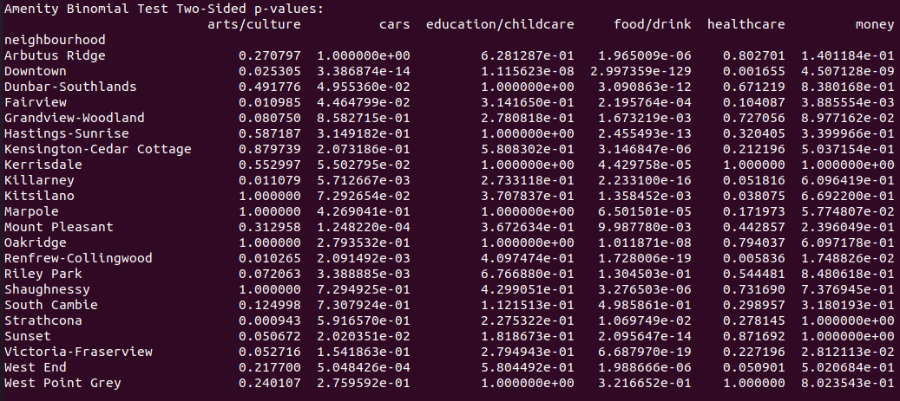
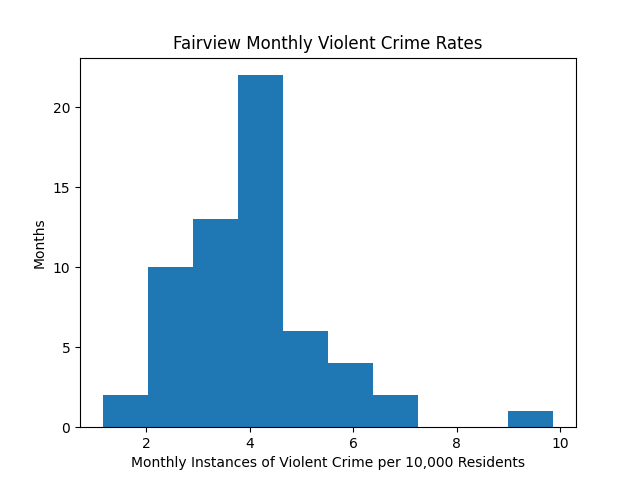

# CMPT353 Final Project - Vancouver Neighbourhood Analysis - README

All code for this project runs with Python3 from the command line.

### Required Libraries:
- [ ]     folium | version 0.12.1
- [ ]     geopandas | version 0.9.0
- [ ]     googlemaps* | version 4.4.5
- [ ]     json 
- [ ]     matplotlib | version 3.4.2
- [ ]     numpy | version 1.17.4
- [ ]     pandas | version 1.2.5
- [ ]     requests* | version 2.22.0
- [ ]     scipy | **version 1.7.0** _It **must** be version 1.7.0 due to a bug with version 1.7.1_
- [ ]     shapely | version 1.7.1
- [ ]     statsmodels | 0.12.2
- [ ]     sys
- [ ]     webbrowser

*`googlemaps` and `requests` technically aren't required since input files have been provided, so there is no need to run any of the data collection scripts.*

_Note: Any missing libraries can be installed using_ **pip install** _or_ **pip3 install**
(i.e. `pip3 install shapely`)

### Running the Code:
**WARNING: NEVER TRY TO RUN `01_a-get_data.py`! THE KEYS TO RUN THE APIS ARE NOT PROVIDED! INSTEAD, ALL NECCESSARY INPUT FILES HAVE BEEN PROVIDED!**

1. After all necessary libraries have been installed, the first file to run is `02-etl_data.py`. This script cleans the input data and transforms it into a format that can be analyzed. To run this file and its associated python scripts, simply navigate into the `RUNME` folder and run the following command from the command line: `python3 02-etl_data.py`

    This should output the following tables to the terminal in the following manner:
    
    
    
    

    In addition, the following files should populate the `RUNME/datafiles` sub-folder:
    - `poulation_extrapolated.csv`
    - `amenities_labelled_by_nbh.csv`
    - `actual_amenity_counts.csv`
    - `monthly_crime.csv`

2. Next, while still in the `RUNME` folder, run `03-analyze_data.py` with a similar command: `python3 03-analyze_data.py`. This file analyzes the data by performing statistical tests and scores the neighbourhoods based on various factors.

    The output to the terminal should be the following tables:
    
    
    
    
    
    
    

    _Note: The FixedFormatter UserWarning can safely be ignored._

    In addition, the following files should populate the `RUNME/datafiles` sub-folder:
    - `skytrain_scores.csv`
    - `price_scores.csv`
    - `expected_amenity_counts.csv`
    - `amenity_scores.csv`
    - `safety_scores.csv`
    - `yelp_scores.csv`

    As part of the analyses, histograms and post-hoc graphs should generate in the `RUNME/figures` folder and its three sub-folders: `crime_hists_post_trans`, `crime_hists_pre_trans`, and `yelp_hists`. Here are some examples:

    
    
    
    
    

3. After the analyses, it's time to recommend a neighbourhood. Run the recommendation script while inside the `RUNME` folder like so: `python3 04-recommend_neighbourhood.py`.

    What should pop up in the terminal is a table of all the scores for all the neighbourhoods like this:
    

    Then the program will ask the user to enter a "desirability score" from 1-5 for each measure analyzed. The user can think of each prompt as the following questions that all begin with "How important is it to you to ...":

    - Distance to Skytrain = ... be close to Skytrain stations?
    - Housing Prices = ... have access to affordable housing?
    - Artistic / Cultural Landmarks = ... be close to artistic or culturally-significant landmarks like places of worship, theaters, and community centres?
    - Automobile Services = ... be close to automotive amenities such as car washes and gas stations?
    - Education / Childcare Facilities = ... have a lot of education or childcare facilities like colleges or kindergartens nearby?
    - Wide Variety of Places to Eat and Drink =  ... be close to a wide variety of places to buy food or drinks like bars, restaurants, and vending machines?
    - Healthcare Clinics = ... have a lot of healthcare clinics such as hospitals, dentist offices, and pharmacies nearby?
    - Safety = ... live in an area with a low amount of violent crime?
    - Restaurant Quality = ... have the highest quality restaurants close by?

    _Note: The program will not proceed until the user enters a score from 1-5. If the user enters a number with a decimal (e.g. 3.7), then their input will be rounded down to the nearest integer (e.g. 3.7 rounds down to 3)._

    

    After that, the program weighs each neighbourhood's scores according to the user's desirability scores and produces a final score for each neighbourhood. It also highlights the top 5 neighbourhoods by final score.

    

    _Note: If there is one file the user should run, it is this one. It only requires the numpy and pandas packages, and when the user tries out many different combinations of preferences, it showcases the versatility of the program.
    To run the neighbourhood recommendation program despite not running any other file, simply navigate inside the `BACKUP` folder and in the terminal run: `python3 04-recommend_neighbourhood.py`_

4. Although the previous file gives the user the scores of each neighbourhood, there is an additional script that creates a fully customizable visual representation of the results. This script creates an `.html` file and automatically opens it with the user's web browser. Then the user can turn different layers on and off based on which results they would like to examine. To create this visualization, either run `python3 05-visualize_results.py` at the terminal from within the `RUNME` folder if you ran the previous three files, or open the `Vancouver_Neighbourhood_Maps.html` file inside the `BACKUP/figures` folder with your web browser if you haven't run `02-etl_data.py` and `03-analyze_data.py`. In addition to turning layers on and off, the user can also see the name of each neighbourhood by hovering over each neighbourhood, they can re-arrange the legend by clicking and dragging, and they can see the names of Vancouver's Skytrain stations by clicking on the appropriate marker.

Here are some screenshots of the map with different layers selected:

